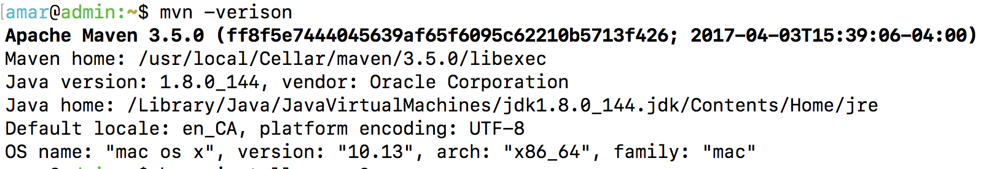
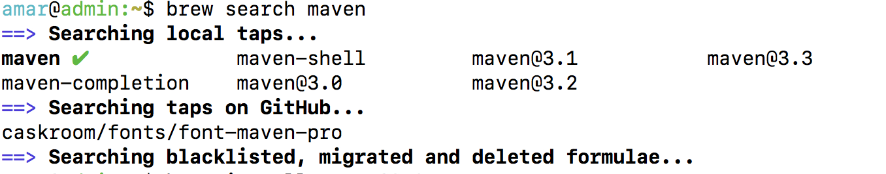
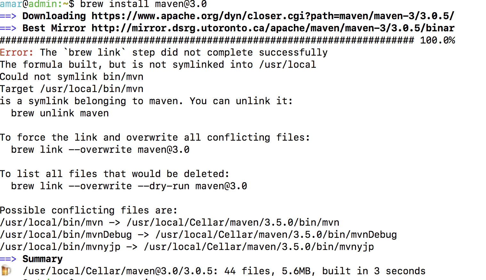
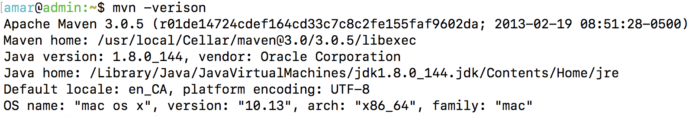

# Downgrading maven version in brew

Check current version of `maven` using

```
mvn -verison
```

This will give you current version and the installation path as well. In my case current version is 3.5.0 as shown below

<center></center>


Then search for available versions of maven using

```
brew search maven
```

This will show you all the available versions as shown below

<center></center>


If you want to install maven 3.0 for instance, then type

```bash
brew install maven@3.0
```

This will install the downgraded version and show some caveats as well

<center></center>


Now the next step is to unlink older maven version and then overwrite it with version you just installed

```bash
brew unlink maven
brew link --overwrite maven@3.0
```

Now check version of maven again. if everything went well ,then you will see that version has been downgraded.

<center></center>

