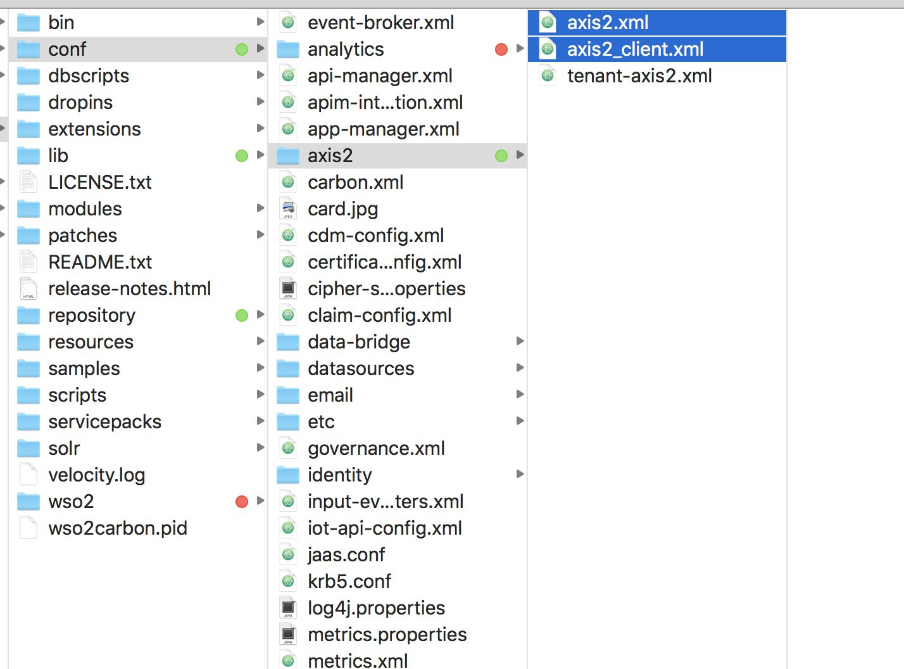
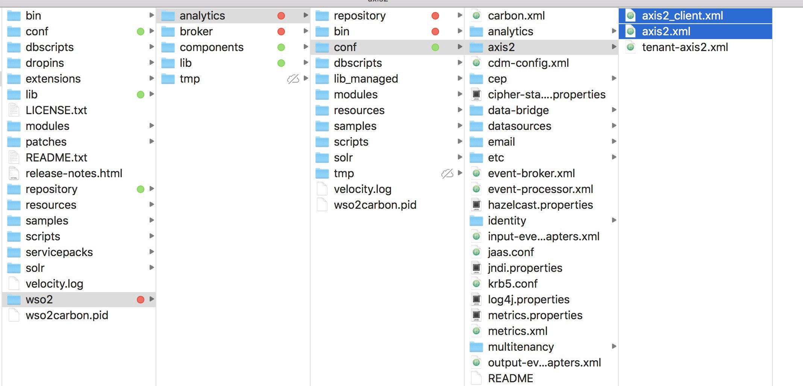
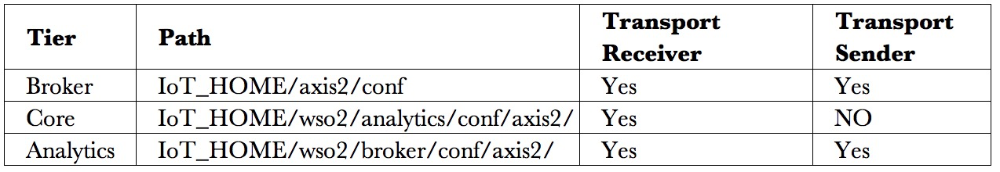
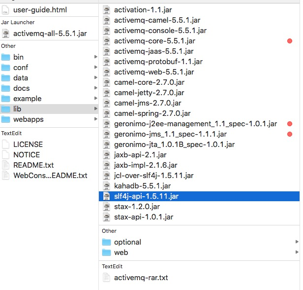
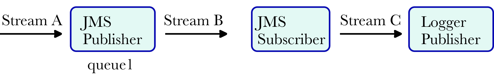

# Setting up JMS Queue in WSO2 IoT Server

I was struggling for few days to get JMS queue up-and-running in `WSO2 IoT Server`. In my experience, setting the queue is easy in programming, but when it comes to complicated systems, sometime small mistakes can consume lot of time. So, without any further ado, lets get going. Please make sure the `WSO2 IoT server` is in off state. I will let you know when to turn it on.

## Knowing the configuration file paths

The WSO2 IoT server consists of 3 tiers: `Broker`, `Core` and `Analytics` as shown below

<center></center>

Now, for using the JMS there are 3 options in WSO2 IoT server, which are

1. Using Apache ActiveMQ
1. Using Apache Qpid
1. Using WSO2 Message Broker (MB)

Out of these, the first option worked for me. The important thing to understand is that, we need to enable the ActiveMQ configurations for all three tiers i.e. Broker, Core and Analytics. The most confusing part is the file structure for configurations, as WSO2 has so many products that even most of paths mentioned in documentation got me confused. So, I would advice you to write the paths down or mark the folders using color coding. Path for IoT Core is shown below <center></center>


Mark both `.xml` files which are selected in fugure. Next, the path for IoT Analytics as shown below <center></center>


The path of `IoT broker` is in `wso2/broker/conf/axis2` similar to IoT analytics.

## Setting up the configuration for JMS

Once you know all the paths, lets make the required changes in `axis2.xml` file as shown below

### Enable Transport Receiver
Please note that JMS queue has 2 components: receiver and sender. First we will add the receiver part. If you open the `axis.xml` file and search for `jms` you will find the three blocks of code related to receiver part. Please uncomment the code related to ApacheMQ as shown below.

```xml
<transportReceiver name="jms" class="org.apache.axis2.transport.jms.JMSListener">
        <parameter name="myTopicConnectionFactory">
         <parameter name="java.naming.factory.initial">org.apache.activemq.jndi.ActiveMQInitialContextFactory</parameter>
         <parameter name="java.naming.provider.url" locked="false">failover:tcp://localhost:61616</parameter>
            <parameter name="transport.jms.ConnectionFactoryJNDIName" locked="false">TopicConnectionFactory</parameter>
            <parameter name="transport.jms.ConnectionFactoryType" locked="false">topic</parameter>
             <property name="userName" value="admin"/>
             <property name="password" value="admin"/>
        </parameter>
<parameter name="myQueueConnectionFactory">
         <parameter name="java.naming.factory.initial">org.apache.activemq.jndi.ActiveMQInitialContextFactory</parameter>
         <parameter name="java.naming.provider.url" locked="false">failover:tcp://localhost:61616</parameter>
            <parameter name="transport.jms.ConnectionFactoryJNDIName" locked="false">QueueConnectionFactory</parameter>
            <parameter name="transport.jms.ConnectionFactoryType" locked="false">topic</parameter>
             <property name="userName" value="admin"/>
             <property name="password" value="admin"/>
             
        </parameter>
<parameter name="default">
         <parameter name="java.naming.factory.initial">org.apache.activemq.jndi.ActiveMQInitialContextFactory</parameter>
         <parameter name="java.naming.provider.url" locked="false">failover:tcp://localhost:61616</parameter>
            <parameter name="transport.jms.ConnectionFactoryJNDIName" locked="false">TopicConnectionFactory</parameter>
            <parameter name="transport.jms.ConnectionFactoryType" locked="false">topic</parameter>
             <property name="userName" value="admin"/>
             <property name="password" value="admin"/>
             
        </parameter>
</transportReceiver>
```
As you have noticed, I have made some additional changes in given code, one of which is to add failover in front of `tcp://localhost:61616` and other is to add both `username` and `password`. The failover helps to reestablish the connection when connection breaks which often happen in real world scenarios.

### Enable Transport Sender
```xml
<transportSender name="jms" class="org.apache.axis2.transport.jms.JMSSender"/>
```

Un-comment the above code which is also available in file. Please make sure that there is no error when you un-comment the code. If you think there is some issue, please go ahead and copy paste the below code.

###  Making Changes in axis2_client.xml file
Just enable the JMS sender by un-commenting the given sender code as shown below. There are no settings for JMS receiver in this file.

```xml
<transportSender name="jms"
    class="org.apache.axis2.transport.jms.JMSSender"/>
```
###  Enable Receiver and Sender for Broker, Core and Analytics

Yes, you have to enable aforementioned settings for both `axis2.xml` and `axis2_client.xml` for all three tiers except the exeption mentioned below. Take some time to make sure that there is no mistake while un-commenting the code.

!!! Error "Exception" 
    Please dot not enable Transport Sender in IoT_HOME/conf/axis2.xml and IoT_HOME/conf/axis2_client.xml. However, enable Transport sender for all the tiers. A summarized view is given in below table.
    <center></center>


## Download the required dependencies.

!!! warning "Caveat"
    The ActiveMQ libraries need to be available in various classpath folder of IoT server. You need to copy the jars from the lib folder of the ActiveMQ as shown below.
    <center></center>

In case you use the dependency manager such as brew or apt-get to install ActiveMQ, then please find the right version of the ActiveMQ and download the binary version to get jars or go to installation folder. As I used ActiveMQ version 5.5.1 , thus these are the required jars.

Download these jar files form maven central

1. `activemq-core-5.5.1.jar`
1. `axis2-transport-all-1.0.0.jar`
1. `geronimo-j2ee-management_1.0_spec-1.0.1.jar`
1. `geronimo-jms_1.1_spec-1.1.1.jar`

Place them in following 3 locations.

1. `wso2_home/lib`
1. `wso2_home/wso2/lib`
1. `wso2_home/wso2/components/lib`

Here, the `wso2_home` is the main installation directory for IoT server. Congrats, we are halfway thorough. Now is time to do some installation

## Install and start ActiveMQ

If you are mac user, then type `brew install activemq` to download ActiveMQ. Further, start the ActiveMQ using `activemq start` . Now, check status using `activemq status`. Please use your favorite package manager such as `apt-get` or `choco` to download the ActiveMQ, if you are using Linux or Windows respectively.

!!! warning "Caveat"
    If you run activemq start multiple times, it will kick off multiple JVMs to run the broker. However since you did not specify any unique broker configuration, each instance will use the same default broker configuration from `conf/activemq.xml`. And that typically means each broker instance will compete for the lock on the default `KahaDB` store. Only one instance will get the lock on that store and fully start up (the master broker), the other instances will continue to compete for the lock (slave brokers).

## Start the IoT Server i.e. broker, core and analytics.

While the products are starting, run a find search in terminal for jms keyword. This way you will know if there is some issue related to JMS. Message broker should say that jms sender started as shown below <center></center>


## Make pipeline

First make the basic pipeline so that you have the streaming data arriving at IoT server to a particular stream say `stream A`. Now we will add the `stream A` to JMS queue publisher. Then we need the JMS receiver to get the data from JMS publisher and further sends it to a logger. Lets understand it by below figure.

<center></center>


As shows in the above figure the JMS publisher receives the `stream A` and en-queues the tuples/events in `queue1`. Further the JMS Subscriber subscribes to queue1 and send it to `Stream C` . Further `Stream C` is published to Logger publisher which shows the logs in Analytics terminal console .

Setting for JMS publisher is given below

```xml
<?xml version="1.0" encoding="UTF-8"?>
<eventPublisher name="jms_pub" processing="enable" statistics="enable"
  trace="enable" xmlns="http://wso2.org/carbon/eventpublisher">
  <from streamName="stream1_scep_timestamped" version="1.0.0"/>
  <mapping customMapping="disable" type="json"/>
  <to eventAdapterType="jms">
    <property name="transport.jms.DestinationType">queue</property>
    <property name="transport.jms.Destination">queue1</property>
    <property name="transport.jms.ConcurrentPublishers">allow</property>
    <property name="java.naming.factory.initial">org.apache.activemq.jndi.ActiveMQInitialContextFactory</property>
    <property name="java.naming.provider.url">tcp://localhost:61616</property>
    <property name="transport.jms.ConnectionFactoryJNDIName">QueueConnectionFactory</property>
    <property name="transport.jms.UserName">admin</property>
    <property encrypted="true" name="transport.jms.Password">aa47+5/q7d9AvOHUyYAJDXrx0Q6GQmgzIKS/hOkzp6huHrxslJJk6Oqmv2mrW159DOTfJ7Rw2nBbfGWjGiMckTFAO9p9YVF3kDDHhiyirWEJPSESSSJeBB782qnwoXEDSAjgiiUYWSRuYIfxdibXUUZr3JPSmjaxvy+EVMjjWgouMrid51UQTW50wl3C0fX03/nak4P9+GWx14T1JGAb07fKQlgK/AwYtJ8esNyiV1j0Z2jgGM9OLpqgZ9gqjsA95htzdqy2DgC/U74qfhkUKISAXUWZdGS+rCEYBFaVzAj0aPKtXmRWTrC6OTDSTVLQCKZPfcHqnU652PUQZqqKCA==</property>
  </to>
</eventPublisher>
```

The username and password are `admin` and `admin`. Only the setting you need form here are the configuration setting like url etc. Make sure to use a unique queue name like I used `queue1`. Take a note of it as we need to subscribe to it in JMS receiver. Also, one more important thing, there are 2 options in JMS i.e. `queue` or `topic`. Make sure you use the same in JMS publisher and JMS Receiver. Also as I am using the queue, hence I used `QueueConnectionFactory`. The code for JMS receiver is also similar as shown below

```xml
<?xml version="1.0" encoding="UTF-8"?>
<eventReceiver name="jms_sub" statistics="disable" trace="disable" xmlns="http://wso2.org/carbon/eventreceiver">
    <from eventAdapterType="jms">
        <property name="transport.jms.DestinationType">queue</property>
        <property name="transport.jms.Destination">queue1</property>
        <property name="java.naming.factory.initial">org.apache.activemq.jndi.ActiveMQInitialContextFactory</property>
        <property name="java.naming.provider.url">tcp://localhost:61616</property>
        <property name="transport.jms.SubscriptionDurable">false</property>
        <property name="transport.jms.ConnectionFactoryJNDIName">QueueConnectionFactory</property>
        <property name="transport.jms.UserName">admin</property>
        <property encrypted="true" name="transport.jms.Password">aa47+5/q7d9AvOHUyYAJDXrx0Q6GQmgzIKS/hOkzp6huHrxslJJk6Oqmv2mrW159DOTfJ7Rw2nBbfGWjGiMckTFAO9p9YVF3kDDHhiyirWEJPSESSSJeBB782qnwoXEDSAjgiiUYWSRuYIfxdibXUUZr3JPSmjaxvy+EVMjjWgouMrid51UQTW50wl3C0fX03/nak4P9+GWx14T1JGAb07fKQlgK/AwYtJ8esNyiV1j0Z2jgGM9OLpqgZ9gqjsA95htzdqy2DgC/U74qfhkUKISAXUWZdGS+rCEYBFaVzAj0aPKtXmRWTrC6OTDSTVLQCKZPfcHqnU652PUQZqqKCA==</property>
    </from>
    <mapping customMapping="disable" type="json"/>
    <to streamName="stream1_scep_timestamped" version="2.0.0"/>
</eventReceiver>
```
Now add the logger and send some events to `stream A`. If all went right, you should see the output at analytics tier console.